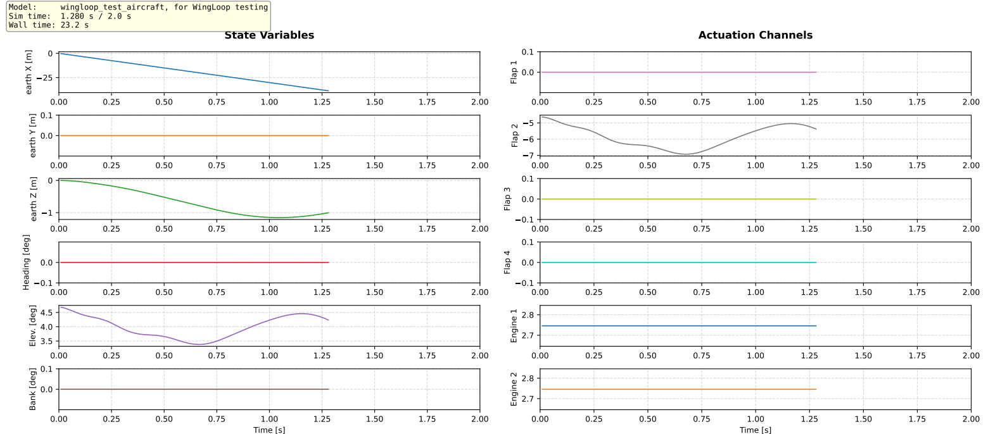
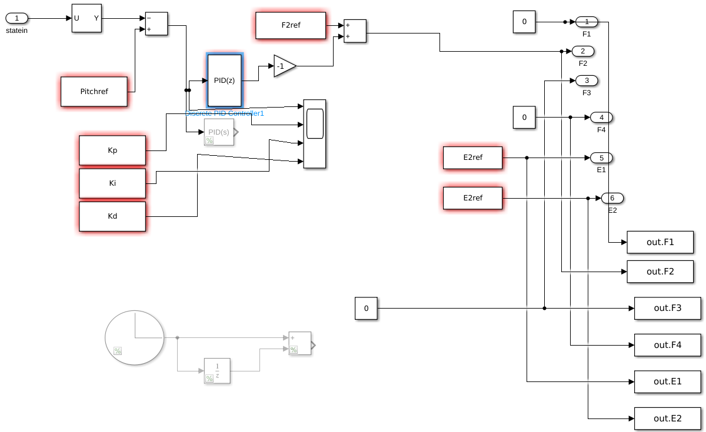

## WingLoop 3.0
<div align="center">
  
</div>

**Authors:** Leonardo Avoni; Matteo Alfonso Incarbone (**Simulink V2**)
**Contacts:** avonileonardo@gmail.com; lpmatteo241@gmail.com  
**Last Modified:** 10/03/2026  
**Platform:** Ubuntu  
**Tested with:** ASWING 5.98  

---

## Overview

WingLoop is a closed-loop control framework that extends the capabilities of [ASWING](https://web.mit.edu/drela/Public/web/aswing/), a structural and aerodynamic analysis tool for flexible aircraft. While ASWING natively supports only linear bi-scheduled controllers, WingLoop integrates ASWING with Python — and optionally MATLAB or Simulink — to enable arbitrary control laws, including nonlinear strategies.

The simulation advances in a time-marching loop, either step by step or in chunks of *K* timesteps. Between iterations, the simulation state is passed to Python — and then to MATLAB or Simulink if needed — where the control laws are computed. The resulting control inputs are returned to ASWING for the next timestep, enabling closed-loop simulations with arbitrary controllers.

In the following, Wingloop 3.0 is presented, including an added feature referred to here as **Simulink V2**. In the Simulink family, the best results so far have been obtained with Simulink V2: it improves execution time and strengthens the MATLAB-Simulink-ASWING connection compared with the older Simulink variants described below, including Simulink with GUI, Simulink without GUI, and FMU-based workflows with or without recompilation.

The original benchmark and controller-backend discussion are kept first. A dedicated **Simulink V2 Current Implementation** section is provided afterwards, explaining the current repository layout and how the active Simulink V2 workflow is configured and executed.

### Reference Publication

> Leonardo Avoni, Murat Bronz, Jean-Philippe Condomines and Jean-Marc Moschetta.  
> *"Enhancing ASWING Flight Dynamics Simulations with Closed-Loop Control for Flexible Aircraft,"*  
> AIAA 2025-3425. AIAA AVIATION FORUM AND ASCEND 2025. July 2025.  
> https://arc.aiaa.org/doi/10.2514/6.2025-3425

---

## Installation

From the `02_WingLoop` folder, run:

```bash
pip install -e .
```

After installation, the following imports will be available:

```python
from WingLoop_Library import Aswing_Director
from WingLoop_Library import WingLoop
```

---

## Repository Structure

```
WingLoop_Library/
├── Aswing_Director.py          # Communicates with ASWING (sends commands)
├── WingLoop.py                 # Main loop director — orchestrates the full WingLoop execution
├── PyControl.py                # Handles control logic: receives states and dispatches to control laws
├── PyControl_IO.py             # Reads ASWING state files; writes control input files for ASWING
├── PyControl_Plot.py           # Real-time and post-run plotting utilities
├── PyControl_additional.py     # Legacy code from earlier WingLoop versions
├── __init__.py
│
├── test_files/
│   ├── readme
│   ├── test_aircraft/
│   ├── test_controllers/
│   │   ├── matlab/
│   │   ├── python/
│   │   ├── simulink/
│   └── test_output/
│
└── wingloop_testrun/
    ├── results/                # containing PID testing results
    ├── aswing_geometry/
    ├── matlab_controller/
    ├── python_controller/
    ├── simulink_controller/
    └── wingloop_testrun.py
```

---

## Library Components

| Module | Description |
|---|---|
| `WingLoop.py` | Top-level director of the WingLoop execution loop |
| `Aswing_Director.py` | Interface to ASWING; sends commands to the simulator |
| `PyControl.py` | Receives aircraft states from ASWING and dispatches to control laws (Python, MATLAB, Simulink) |
| `PyControl_IO.py` | I/O utilities: reads ASWING state files, writes control input files |
| `PyControl_Plot.py` | Plotting utilities for real-time monitoring and post-run analysis |
| `PyControl_additional.py` | Legacy utilities from earlier versions |

Further details on each module are available in the header of the respective source file. Individual modules can also be run and tested independently via their `__main__` block.

---

## Supported Controller Types

- **Python** — native Python control laws
- **MATLAB** — via MATLAB's Python API
- **Simulink** — via FMU export or MATLAB/Simulink API

---

## WingLoop TestRun

The `wingloop_testrun` case is designed to assess WingLoop's behavior and performance across all supported controller types. A simple PID controller is applied to the aircraft shown below, featuring 4 groups of control surfaces and two engines. The same controller is implemented in five different ways: Python, MATLAB, Simulink, compiled Simulink (FMU), and ASWING's native controller format. All ASWING-relevant files (trimming state, gust file, ASWING controller file, etc.) are located in the `aswing_geometry` folder.

<div align="center">
  
  <p><em>Test aircraft configuration</em></p>
</div>

To run the test case:

```bash
cd WingLoop_Library/wingloop_testrun
python wingloop_testrun.py
```

<div align="center">
  
  <p><em>WingLoop GUI during a simulation run</em></p>
</div>

A sample `.json` output from a completed run is available [here](docs/wingloop_test_aircraft.json).

> **Note on the ASWING-native case:** when using the ASWING built-in controller, WingLoop is bypassed entirely — the controller is integrated directly within the ASWING execution. Results are equivalent to the WingLoop cases, with the exception of a one-timestep lag inherent to the WingLoop coupling method.

### Scenario

The controller objective is to stabilize the aircraft in response to a 1-cosine gust.

**Flight conditions:**
- Leveled, horizontal flight at $V_{\infty} = 30\ \mathrm{m/s}$
- 1-cosine vertical gust (frozen-flow) applied as perturbation: distance to gust start −15 m, gust zero-to-peak distance 15 m, peak vertical velocity 3 m/s

**Simulation parameters:** $N = 300$, $K = 1$, $\Delta t = 0.01\ \mathrm{s}$ — plot refresh every 1 s

**PID gains:** $K_P = 100\ \mathrm{[deg/rad]}$, $K_I = 100\ \mathrm{[deg/(rad \cdot s)]}$, $K_D = 20\ \mathrm{[deg \cdot s/rad]}$

### Test Machine

Benchmarks were collected on the following machine, running only VSCode and ASWING in the background:

| | |
|---|---|
| **Model** | Dell Inc. Precision 3581 |
| **RAM** | 32.0 GiB |
| **CPU** | 13th Gen Intel® Core™ i7-13800H × 20 |
| **GPU** | NVIDIA Corporation / Mesa Intel® Graphics (RPL-P) |
| **Storage** | 1.0 TB |
| **OS** | Ubuntu 22.04.5 LTS |


> Timing results are machine-dependent and will vary on different hardware.

### Performance Results

Timing is split into two categories:

- **Overhead time** — one-off startup cost (WingLoop initialisation, MATLAB engine startup, FMU compilation, etc.)
- **Computational time** — wall-clock time to complete all $N$ iterations

**Baseline — ASWING with native controller (no WingLoop):**

| Overhead | Computational time |
|---|---|
| — | 10.70 s |

**WingLoop results by controller type:**

| Controller | Plot ON [s] | Δ Plot ON | Plot OFF [s] | Δ Plot OFF | Overhead [s] |
|---|---|---|---|---|---|
| Python                        | 15.01 | +40.3% | 11.73 |  +9.6% |  0.49 |
| MATLAB                        | 15.94 | +49.0% | 12.92 | +20.7% |  2.95 |
| Simulink (With GUI)                      | 138.0 | +1190% | 137.3 | +1183% | 18.58 |
| Simulink (Without GUI)                      | 105.0 | +881% | 91.06 | +751% | 13.51 |
| Simulink V2 (current)                       | / | / | / | / | / |
| Simulink FMU (recompiled then run)     | 14.64 | +36.8% | 11.98 | +12.0% | 26.50 |
| Simulink FMU (non-recompiled then run) | 14.88 | +39.1% | 11.87 | +10.9% |  0.53 |

*Δ columns show computational time increase relative to the ASWING baseline (10.70 s). These are* ***not*** *official benchmarks — they give a rough sense of the relative cost of each integration approach. Since computational time scales linearly with* $N$*, the per-iteration cost can be estimated by dividing by* $N = 300$*.*

> Note how Simulink FMU compilation takes overhead time, but allows faster simulink execution, very close to Python controller performance. Note also how updating the life WingLoop plots makes simulation slower.
For speed advice: if the controller is simple, choose Python or Matlab. If you absolutely need Simulink, you can use the non-FMU version to check if the controller works as intended, and the compiled FMU for speed.

---
## Rules for Writing a Simulink Controller


As a reference, the example controller in the `simulink_controller` folder demonstrates
all of the above rules. Its block diagram is shown below. Note that this controller has no
physical meaning and was written purely to exercise and validate the WingLoop–Simulink
interface.

<div align="center">
  
  <p><em>Block diagram of simulink_test_controller.slx.</em></p>
</div>

The following rules must be respected when writing a Simulink controller for WingLoop:

**Solver settings** (Model Settings → Solver → Solver Selection):
set the solver type to "Fixed-step" and the solver to "discrete (no continuous states)".
The fixed-step size can be left as `-1` (auto/inherited) — WingLoop will enforce its own
timestep `Dt` at runtime.

**Use discrete blocks only.** Continuous blocks are incompatible with the discrete solver
and will cause errors or incorrect results.

**Retrieving the current timestep** inside the model: use a Clock block, feed it into a
Unit Delay, and subtract the Unit Delay output from the Clock output. The result equals
the current simulation timestep `Dt`.

**Derivative filter coefficient `N`** (relevant for any block with a derivative term,
such as the Discrete PID): always use a filtered derivative. The filter pole is located
at `1 - N·Dt`, so `N·Dt > 1` places it outside the unit circle and causes instability
even when an equivalent Python or MATLAB controller is stable.

Validation tests across Dt = {2×10⁻², 1×10⁻², 5×10⁻³} s show that `N·Dt = 1.0`
produces identical results across all WingLoop controller backends (Python, MATLAB,
Simulink, and FMU), and is therefore the recommended value. Choosing `N·Dt > 1.0`
leads to unstable Simulink behavior.

It is strongly recommended to use the already available  `Nfilter = 1.0 / Dt` defined from 
WingLoop in the `.slx` file. This ensures consistency with whatever timestep `Dt` is set in 
WingLoop, with no manual edits to the Simulink model required. This method does not prohibit 
the user from enforcing a value of `N` different from `Nfilter`.

**Inputs:** place a single Inport block named `statein`. This receives the full WingLoop
state vector at each timestep.

**Outputs:** for each control command, add both:
- an Outport block, and
- a To Workspace block pointing to the same signal,

using ASWING-compatible signal names (e.g. `F1`, `F2`, `E1`, `E15`). Both are required:
the Outport is used by WingLoop to read the controller output, and the To Workspace block
enables signal logging and inspection in the Simulink workspace.

**Workspace variables:** blocks that reference MATLAB workspace variables (gains, lookup
tables, filter coefficients, etc.) do not need those variables to exist inside the `.slx`
file itself. Any variable your Simulink model needs must instead be declared and pushed to
the MATLAB base workspace inside `UserController.m`, using `assignin('base', ...)` in the
constructor. WingLoop guarantees that `UserController.m` is executed before the first
`sim()` call, so all variables will be available when Simulink runs.

---
## Multimedia Export

The **Wingloop** module also includes several utilities for analyzing ASWING outputs, including video generation and stroboscopic image export. These post-processing functions are executed at the end of the `wingloop_testrun.py` script and are implemented in `ASW_Helpers.py`.

<div align="center">
  
  <p><em>Flexible aircraft simulation (video output).</em></p>
</div>

<div align="center">
  
  <p><em>Flexible aircraft simulation (stroboscopic view).</em></p>
</div>

---
## License

WingLoop is licensed under **[CC BY-NC-SA 4.0](https://creativecommons.org/licenses/by-nc-sa/4.0/)** — free for non-commercial use with attribution.

**Commercial use is not permitted under this license.** If you wish to use WingLoop in a commercial context, please contact the author to discuss a separate agreement:
**Leonardo Avoni** — avonileonardo@gmail.com

If you use WingLoop in academic work, please cite:
> Leonardo Avoni, Murat Bronz, Jean-Philippe Condomines and Jean-Marc Moschetta.
> *"Enhancing ASWING Flight Dynamics Simulations with Closed-Loop Control for Flexible Aircraft,"*
> AIAA 2025-3425. AIAA AVIATION FORUM AND ASCEND 2025. July 2025.
> https://arc.aiaa.org/doi/10.2514/6.2025-3425

See [`LICENSE`](LICENSE) and [`CONTRIBUTING.md`](CONTRIBUTING.md) for full details.

---

## Simulink V2 Current Implementation

The following section documents the current Simulink V2 workflow. This is the active implementation in this repository: MATLAB configures the run, Simulink computes the control action, a MATLAB System block exchanges data over TCP, and Python/WingLoop drives ASWING.

## Simulink V2 Main Features

WingLoop provides:

- ASWING process management
- TCP communication between Simulink and Python
- Exchange of ASWING states and Simulink control inputs
- Open-loop and closed-loop Simulink simulations
- ASWING state and JSON result export
- Optional plot and video generation tools

---

## Repository Structure

```text
WingLoop/
|-- README.md
|-- docs/
|-- WingLoop_Library/
|   |-- ASW_Helpers.py
|   |-- Aswing_Director.py
|   |-- PyControl.py
|   |-- PyControl_IO.py
|   |-- PyControl_Plot.py
|   |-- PyControl_additional.py
|   |-- WingLoop.py
|   |-- __init__.py
|   |-- icon/
|   |   `-- wingloop_icon.png
|   |-- MatlabUtilities/
|   |   |-- AswingPlant.m
|   |   |-- Bridge_Simulink.py
|   |   |-- controller_wingloop.py
|   |   |-- run_wingloop_simulink_setup.m
|   |   |-- wingloop_profile.py
|   |   `-- WL_init_callback.m
|   `-- wingloop_testrun/
|       |-- aswing_geometry/
|       |   |-- t_tail_HALE.asw
|       |   |-- t_tail_HALE.pnt
|       |   |-- t_tail_HALE.set
|       |   |-- t_tail_HALE.state
|       |   `-- gust_H40.gust
|       |-- setup_aswing_case_from_old.sh
|       `-- simulink_controller_2/
|           |-- WingLoop_Controller.slx
|           |-- WingLoop_Simulink_Testrun.m
|           |-- wingloop_python_server.log
|           `-- config/
|               |-- python_inputs.txt
|               `-- sim_config.json
```
Generated files such as `input`, `output`, `sim_results.*`, `slprj/`, `__pycache__/`, and `.slxc` files should not be committed to the repository.

`setup_aswing_case_from_old.sh` is an optional migration helper. It copies an
existing ASWING working folder and geometry file into `aswing_geometry/`; it is
not required for normal Simulink runs once the case files are already present.

---

## Requirements

The following software is required:

- Windows with WSL
- Python 3.10+
- ASWING
- MATLAB
- Simulink
- NumPy
- Matplotlib

Optional tools for video generation:

- Ghostscript
- FFmpeg

Install Python dependencies with:

```bash
pip install -r requirements.txt
```

If Ghostscript and FFmpeg are needed:

```bash
sudo apt install ghostscript ffmpeg
```

---

## ASWING Command Alias

WingLoop expects ASWING to be launchable from the WSL terminal.

For example, the command:

```bash
aswing
```

should start ASWING.

If needed, define an alias in your shell configuration file, for example:

```bash
alias aswing='/path/to/aswing'
```

Then reload the shell:

```bash
source ~/.bashrc
```

---

## Running the Simulink Example

Open MATLAB and run the user-facing main script:

```matlab
WingLoop_Simulink_Testrun
```

from:

```text
WingLoop/WingLoop_Library/wingloop_testrun/simulink_controller_2/
```

`WingLoop_Simulink_Testrun.m` is the main entry point of the workflow. It configures the simulation parameters, selects the ASWING files, sets the model dimensions and trim inputs, writes `sim_config.json`, configures `AswingPlant.m`, and starts the Simulink simulation.

When the model is ready, press **Run** in Simulink.

The Simulink model automatically launches the Python WingLoop server through WSL. The Python server starts ASWING and exchanges data with the `AswingPlant.m` block through TCP.

---

## Simulink Interface

The Simulink interface is based on:

```text
WingLoop/WingLoop_Library/MatlabUtilities/AswingPlant.m
```

`AswingPlant.m` is a MATLAB System block that communicates with Python through TCP.

The Python-side TCP bridge is:

```text
WingLoop/WingLoop_Library/MatlabUtilities/Bridge_Simulink.py
```

The user-facing main script is:

```text
WingLoop/WingLoop_Library/wingloop_testrun/simulink_controller_2/WingLoop_Simulink_Testrun.m
```

This is the file where the user sets the simulation time, ASWING case files, model dimensions, trim inputs, and Simulink model name.

The Python script:

```text
WingLoop/WingLoop_Library/MatlabUtilities/controller_wingloop.py
```

is launched automatically by the Simulink workflow through WSL and should normally not be edited by the user.

---

## Changing the Aircraft Model

WingLoop does not automatically generate aircraft trim conditions, reduced-order models, or ASWING initialization files.

To use a different aircraft, the user must manually provide the corresponding ASWING files and update the aircraft-specific parameters used by the Simulink model.

### Step 1 — Place the ASWING Geometry File

Place the aircraft geometry file:

```text
aircraft.asw
```

inside:

```text
WingLoop/WingLoop_Library/wingloop_testrun/aswing_geometry/
```

For the provided example:

```text
WingLoop/WingLoop_Library/wingloop_testrun/aswing_geometry/t_tail_HALE.asw
```

Only the `.asw` geometry file should be placed in `aswing_geometry/`.

### Step 2 — Place the ASWING Initialization Files

Place the three ASWING initialization files:

```text
aircraft.pnt
aircraft.set
aircraft.state
```

inside:

```text
WingLoop/WingLoop_Library/wingloop_testrun/aswing_geometry/
```

For the provided example:

```text
WingLoop/WingLoop_Library/wingloop_testrun/aswing_geometry/t_tail_HALE.pnt
WingLoop/WingLoop_Library/wingloop_testrun/aswing_geometry/t_tail_HALE.set
WingLoop/WingLoop_Library/wingloop_testrun/aswing_geometry/t_tail_HALE.state
```

Optional gust files should also be placed inside:

```text
WingLoop/WingLoop_Library/wingloop_testrun/aswing_geometry/
```

For example:

```text
WingLoop/WingLoop_Library/wingloop_testrun/aswing_geometry/gust_H40.gust
```

### Step 3 — Select the Files in the MATLAB Main Script

Open the user-facing main script:

```text
WingLoop/WingLoop_Library/wingloop_testrun/simulink_controller_2/WingLoop_Simulink_Testrun.m
```

and select the ASWING files to be used by the simulation:

```matlab
ASW_FILE = 't_tail_HALE.asw';

PNT_FILE   = 't_tail_HALE.pnt';
SET_FILE   = 't_tail_HALE.set';
STATE_FILE = 't_tail_HALE.state';
GUST_FILE  = 'gust_H40.gust';
```

These file names are written automatically to `sim_config.json`, which is then read by `controller_wingloop.py`.

The Python launcher should not be modified when changing aircraft.

### Step 4 — Update the Aircraft Dimensions

In the same MATLAB main script, update the aircraft-dependent dimensions:

```matlab
ROM.n_modal      = 91;    % Number of modal states, if a ROM is used

FullModel.n_orig = 1882;  % Number of original physical states
FullModel.n_in   = 6;     % Number of control inputs
```

These values depend on the selected aircraft geometry and on the state/input definition used by the Simulink model.

The dimensions used by `AswingPlant.m` are computed automatically from:

```matlab
NumModalStates    = ROM.n_modal;
NumPhysicalStates = FullModel.n_orig + FullModel.n_in;
```

Therefore, `NumModalStates` and `NumPhysicalStates` should not be edited manually inside `AswingPlant.m`.

### Step 5 — Update the Trim Inputs

The trim input vector must match the trimming point contained in the selected `.state` file.

For the provided example:

```matlab
F2ref = -6.63806152;
F3ref = 4.54747351E-12;
E2ref = 23.6475887;

u_trim = [ ...
    0, ...
    F2ref, ...
    F3ref, ...
    0, ...
    E2ref, ...
    E2ref ...
];
```

When using a different trim point, the user must update `F2ref`, `F3ref`, `E2ref`, and `u_trim` accordingly.

The order of `u_trim` must be consistent with the control-input order expected by the Simulink model and by the WingLoop TCP bridge.

---

## ASWING File Path Logic

The Python launcher uses two different folders:

```text
aswing_geometry/
```

for the `.asw` geometry file, and:

```text
aswing_geometry/
```

for the `.pnt`, `.set`, `.state`, gust files, and simulation outputs.

This separation avoids long absolute paths being passed directly to ASWING. The geometry file is passed to ASWING as a short relative path from the ASWING working directory.

---

## Simulation Outputs

Simulation outputs are written inside:

```text
WingLoop/WingLoop_Library/wingloop_testrun/aswing_geometry/
```

Typical generated files include:

```text
input
output
sim_results.json
sim_results.pdf
sim_results.state
plot.ps
videos/
```

These files are generated automatically and should not be committed to GitHub.

---

## Notes

- The aircraft trim condition must already exist in the `.state` file.
- WingLoop does not generate trim conditions automatically.
- The Simulink model is responsible for defining the control law.
- `AswingPlant.m` must run in interpreted execution mode.
- ASWING must be available from the WSL command line.

---

## Troubleshooting

### Simulink cannot connect to Python

Make sure the Python server is running and listening on port `5005`.

### ASWING does not start

Check that the `aswing` command works from WSL.

### Output files are not generated

Check that:

- `.pnt`, `.set`, and `.state` files are in `aswing_geometry/`
- the `.asw` file is in `aswing_geometry/`
- `Aswing_Director.py` and `WingLoop.py` use the corrected file-write synchronization logic
- ASWING is launched from the correct working directory

---

## Acknowledgements

WingLoop was developed to support aeroservoelastic control studies using ASWING and modern control-design environments such as Simulink.
